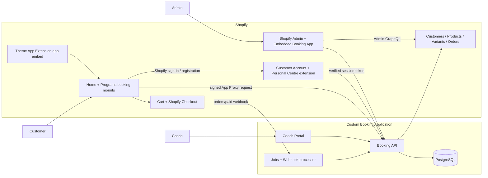
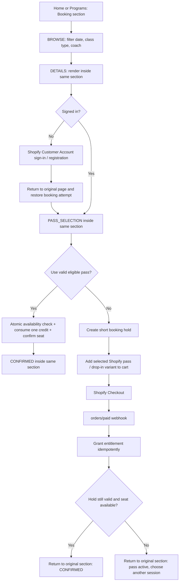
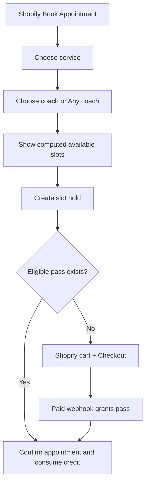
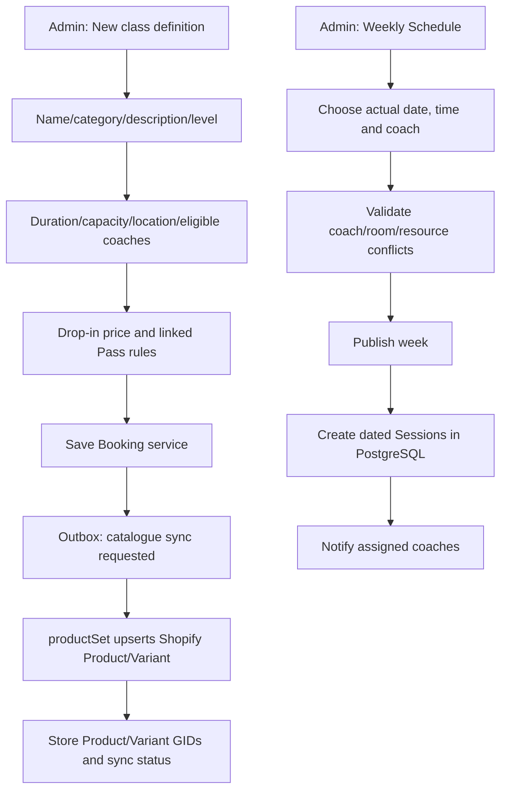

# Skyra Booking System — Shopify Implementation V3

> Approved baseline: Shopify is the customer-facing entry point, identity, product/order system and checkout. One shared Booking section is mounted on both Home and Programs; its non-payment steps render in place without navigating to separate Booking pages. The custom Booking App owns scheduling and booking operations.

## 1. Recommended product architecture



### Why this boundary

- Customer registration/login: Shopify Customer Accounts only. Do not build or store another password.
- Customer browsing: one Theme App Extension app embed loads a shared Booking component into explicit mount nodes in both Home and Programs. The two pages share queries, state transitions, accessibility behaviour and analytics; they do not contain copied schedule logic.
- Customer identity on storefront booking calls: send requests through an App Proxy and verify Shopify's signature. The signed request includes `logged_in_customer_id` when signed in.
- Customer personal centre: a Customer Account full-page extension with **My Overview**, **My Passes**, **Bookings & History** and **Appointments**. It requests a fresh session token close to each backend call; the backend verifies the JWT and maps its customer subject to the Shopify Customer GID.
- Checkout/payment/refunds/tax/discount codes: Shopify native cart and Checkout.
- Admin: a multi-page embedded App Home application inside Shopify Admin.
- Coach: a separate mobile-first portal with app-managed staff authentication and role-based access. Coaches do not need customer credentials or broad Shopify Admin access.

### 1.1 Storefront mounting decision

Use a Theme App Extension **app embed block** for the shared runtime and two small theme-owned mount nodes:

| Theme surface | Current code to replace | Target |
| --- | --- | --- |
| Home | Static “Booking that feels like Skyra” sample rows and preview JavaScript | `<div data-skyra-booking-root data-surface="home">` |
| Programs | Hard-coded “Find a Class” rows and Mindbody links | `<div data-skyra-booking-root data-surface="programs">` |

The app embed loads one versioned JavaScript/CSS bundle, finds each mount, and renders the same Booking component. `data-surface` may control heading copy or initial filters, but never business rules. This avoids consuming the Home section's existing `@app` block reserved for Instafeed and avoids duplicating booking code across Liquid sections.

Public availability comes from the Booking API through the signed App Proxy. Mutating calls require the verified Shopify customer identity. The theme must show a safe loading/error state when the app is unavailable; it must never fall back to fake availability.

## 2. User journeys

### 2.1 Customer books a class



The “stay in the section” rule covers BROWSE, DETAILS, PASS_SELECTION, CONFIRMING, CONFIRMED and recoverable errors. Shopify authentication and Shopify Checkout are intentional top-level hand-offs; both return to an allowlisted Home/Programs URL containing only an opaque booking-attempt token. Shopify payment and seat allocation are two systems, so there is no cross-platform database transaction. Use a short hold plus an idempotent webhook workflow. A late payment must never silently oversell a session.

### 2.2 Customer books an appointment



### 2.3 Admin creates a class type and publishes a weekly schedule



If either Shopify or PostgreSQL write fails, keep the service in `sync_error` or `draft`, show a retry action, and process through an outbox job. Do not pretend the two writes are one atomic transaction.

## 3. Complete page inventory

### 3.1 Shopify storefront and customer account

| Surface | Page | Main functions |
|---|---|---|
| Online Store Home + Programs | Shared Booking section | BROWSE → DETAILS → PASS_SELECTION → CONFIRMING → CONFIRMED in the same mounted section; date/class/coach filters, full calendar expansion, live capacity, eligible existing Pass and new Pass choices |
| Shopify Customer Account | Shopify sign-in/registration | Shopify-managed authentication; return to the originally selected Session after sign-in |
| Customer Account extension | My Overview | Remaining credits, expiring Passes, next class/appointment, quick actions and latest customer-visible coach message |
| Customer Account extension | My Passes | Credit balance, expiry, eligible services, immutable usage history and Shopify order link |
| Customer Account extension | Bookings & History | Upcoming, attended, cancelled, late-cancel and no-show activity; open Class Details and coach messages |
| Customer Account extension | Appointments | New private-session request, upcoming/history, reschedule and customer-visible coach messages |
| Native Shopify | Customer Account sign-in | Top-level authentication hand-off; return to the original page and restore the opaque Booking attempt |
| Native Shopify | Cart and Checkout | Only for a new Pass/drop-in purchase; discounts, gift cards, tax, payment methods and order receipt; return to the original Booking section |

### 3.2 Admin — embedded in Shopify Admin

| Navigation | Purpose and functions |
|---|---|
| Overview | Today's classes and booking exceptions, plus customer-level Pass expiry alerts and unused credits |
| People | One directory with separate Customer and Coach sections; customer Pass/spend/next-booking summary; coach access, eligibility, availability and weekly load |
| Classes & Passes | One offer-setup page. Class name, drop-in price, duration, capacity, location and eligible coaches; Pass price, credits, validity and eligible classes |
| Weekly Schedule | One-week calendar used only to choose the actual class, date, start time and coach; draft, copy previous week, conflict check and publish |
| Bookings | Customer reservations, payment/Pass source, holds, waitlist, transfer, cancellation and attendance actions |
| Reports | Two direct exports: per-customer spend/purchases/refunds, and purchased Passes with remaining credits/expiry |
| Settings | Low-frequency policies, locations/resources, notifications, permissions, integrations, sync health and audit |

Admin information architecture rules:

- Keep the daily navigation to the six task-oriented pages above; do not create separate navigation entries for detail forms.
- Open Customer, Coach, Class, Pass and Booking details in an inline panel/drawer or page section with a clear return path.
- Each page has one sentence that says what the page is for and one primary action.
- Class defaults may include a suggested day/time, but only Weekly Schedule creates actual dated sessions and assigns coaches.
- Notifications and integration diagnostics remain under Settings unless an issue needs to appear in the Overview action queue.

### 3.3 Coach portal

| Page | Main functions |
|---|---|
| Today / My Schedule | Assigned sessions and appointments only |
| Roster | Check-in, attended/no-show, safe client notes |
| Availability | Recurring availability, breaks, time off, exceptions |
| Session Detail | Capacity, waitlist, substitution request, operational notes |
| Reports | Own hours, attendance and utilisation; no store-wide revenue unless permitted |

## 4. Source-of-truth rules

| Data | Source of truth | App stores |
|---|---|---|
| Customer login/account/profile | Shopify | `shopify_customer_id` plus minimal booking projection |
| Service/pass name and sale price | Shopify Product/Variant | Mapping IDs and sync status |
| Orders, payment, discount, tax, refund | Shopify | Order ID, relevant line allocation and last processed state |
| Service duration/capacity/level | Booking DB | Full operational fields |
| Weekly recurrence and generated sessions | Booking DB | Full data |
| Coach identity, role and availability | Booking DB / staff auth provider | Full data |
| Bookings, attendance, waitlist | Booking DB | Full data |
| Pass entitlement and credit ledger | Booking DB, granted from paid/refund webhooks | Full immutable ledger |
| Revenue reports | Shopify Analytics / ShopifyQL | Optional cached aggregates |
| Occupancy, attendance, coach utilisation | Booking DB | Report-ready facts/aggregates |

Do not mirror all Shopify customer and order data. Fetch current display fields when needed and retain only the minimum necessary operational data. Name, email, phone and address are protected customer fields and access must be requested/configured appropriately.

## 5. Core database model

```text
shops
  id, shop_domain, timezone, settings_json

customer_profiles
  id, shop_id, shopify_customer_gid UNIQUE, display_name_cache, status

coaches
  id, shop_id, auth_user_id UNIQUE, name, email, role, status

locations
  id, shop_id, name, timezone, address_json

resources
  id, location_id, name, resource_type, capacity

service_categories
  id, shop_id, name, service_kind, status, sort_order

services
  id, category_id, name, service_kind, duration_min, capacity,
  level, description, booking_policy_id, status

service_coaches
  service_id, coach_id

shopify_product_mappings
  id, service_id NULL, pass_plan_id NULL,
  shopify_product_gid, shopify_variant_gid, sync_status, synced_at

schedule_templates
  id, service_id, coach_id, location_id, resource_id,
  weekday, local_start_time, recurrence_rule, starts_on, ends_on, status

sessions
  id, schedule_template_id NULL, service_id, coach_id, location_id,
  starts_at_utc, ends_at_utc, capacity, status, version

coach_availability / coach_time_off
  coach_id, recurrence_or_range, starts_at, ends_at, status

booking_holds
  id, customer_profile_id, session_id, expires_at, status, token UNIQUE

bookings
  id, customer_profile_id, session_id, status,
  entitlement_id, hold_id, shopify_order_gid NULL, booked_at, version

waitlist_entries
  id, customer_profile_id, session_id, position, status, offered_until

pass_plans
  id, name, credits, validity_days, intro_only, status

pass_plan_services
  pass_plan_id, service_id

entitlements
  id, customer_profile_id, pass_plan_id, source_order_gid,
  starts_at, expires_at, credits_granted, status

credit_ledger
  id, entitlement_id, booking_id NULL, delta, reason, idempotency_key UNIQUE

webhook_events / outbox_events / audit_logs
  event ids, payload references, state, attempts, timestamps, actor
```

Capacity and credit consumption must run in PostgreSQL transactions with row locks or optimistic version checks. Unique constraints should prevent a customer booking the same session twice.

## 6. Sync and workflow rules

### Product and price publishing

1. Admin saves a Class, Appointment service or Pass definition in the embedded app. PostgreSQL commits the operational record and an outbox event in one transaction.
2. A worker uses Admin GraphQL `productSet` to create or update the mapped Shopify Product and sellable Variant. This is an upsert/synchronisation operation, not a second manual admin workflow.
3. Store `shopify_product_gid`, `shopify_variant_gid`, requested version, Shopify version and last error in `shopify_product_mappings`.
4. Define app-owned Product metafields in `shopify.app.toml` and write stable mapping values through `metafieldsSet`. The Worker idempotently ensures the versioned app-owned Service content definition (`$app:booking_service_content_v1`) before `metaobjectUpsert`; PostgreSQL remains the runtime source of truth.
5. Shopify owns the published title, sale price, tax/discount behaviour and sellable status. PostgreSQL owns duration, capacity, eligibility, schedules, credits and bookings.
6. `products/update` webhooks reconcile direct Shopify Admin changes; a periodic reconciliation job repairs missed events or drift.
7. The embedded UI displays `Synced`, `Syncing`, or `Error`, with retry and a direct link to the mapped Shopify Product.

Do not create a Shopify Product for every dated class. One Class/service definition maps to a stable Product/Variant for drop-in sale, and each Pass package maps to its own Product/Variant. A Thursday 10:00 occurrence is a `sessions` row in PostgreSQL only.

### Customer projection and coach messages

- Shopify Customer is the identity and profile authority. Store only `shopify_customer_gid` plus the minimum booking projection; do not copy Shopify passwords or maintain duplicate registration.
- Shopify customer create/update/delete and data-request webhooks update the local projection and retention workflow. Admin directory screens fetch current protected fields only when authorised.
- Coach messages are Booking data linked to a Session or Booking. Every message has a visibility value: `CUSTOMER_VISIBLE` is shown in Customer Account; `INTERNAL` remains limited to authorised staff.
- Customer Account calls carry a verified session token. Never trust a customer ID sent as ordinary browser JSON.

### Paid order processing

1. Receive and verify the Shopify webhook HMAC.
2. Deduplicate by webhook ID and by order/line allocation key.
3. Fetch/enrich the order if required.
4. Convert mapped line items into entitlements.
5. If a valid booking hold is attached, atomically confirm and consume one credit.
6. Send booking confirmation only after the database transaction commits.
7. Reconcile periodically because webhook ordering is not guaranteed.

### Cancellation/refund

- Booking cancellation follows app policy and returns a credit through an immutable ledger entry.
- Payment refunds remain Shopify operations. A refund webhook updates/revokes entitlement state according to a documented business rule.
- A booking cancellation is not automatically a cash refund unless the admin explicitly chooses that workflow.

## 7. Reporting design

The Reports area is hybrid:

- ShopifyQL: gross/net sales, orders, discounts, refunds and sales by pass product.
- PostgreSQL: bookings, attendance, no-shows, cancellation lead time, class occupancy, waitlist conversion, coach hours/utilisation and expiring unused credits.
- Dashboard: place both sets of cards in one embedded Admin App. Do not attempt an unsafe client-side join.
- Later phase: emit selected booking App Events or analytics-queryable metafields so more booking context becomes queryable in Shopify Analytics.

## 8. Recommended implementation stack

- Shopify app: Shopify CLI React Router template, embedded App Home, App Bridge and Polaris web components.
- Storefront: Theme App Extension app embed, explicit Home/Programs mount nodes and signed App Proxy endpoints.
- Customer centre: Customer Account full-page UI extension.
- Backend: TypeScript/Node.js service using the Shopify app template runtime.
- Database: managed PostgreSQL with Prisma.
- Jobs: managed queue for webhooks, session generation, reminders and reconciliation.
- Coach authentication: managed magic-link/OTP provider with app RBAC.
- Observability: structured logs, webhook/outbox dashboard, error monitoring and audit log.

## 9. MVP delivery order

1. Foundation: app install/auth, DB, roles, webhook inbox/outbox and sync health.
2. Admin service catalogue, Shopify product mapping and pricing.
3. Coaches, availability, locations/resources and weekly schedule templates.
4. Session generation, calendar, conflict detection and roster.
5. Storefront class browsing, Shopify sign-in return flow and direct pass booking.
6. Shopify cart/Checkout, paid webhook, holds and entitlement ledger.
7. Customer Account My Overview, My Passes, Bookings & History and Appointments.
8. Appointments and rescheduling.
9. Reports, exports, notifications and operational hardening.

## 10. Explicit non-goals

- No separate customer password/login system.
- No custom card/payment screen.
- No duplicated Shopify order ledger.
- No storing schedules as Shopify products/metafields alone.
- No use of Shopify inventory as the authoritative seat-capacity engine.
- No coach access to all customer/payment data by default.
