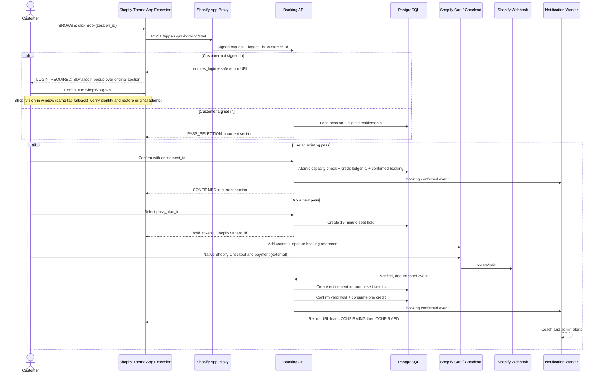

# Skyra — Book, Pass, Checkout and Sync Implementation

## Decision

Build one custom Shopify app with three surfaces:

1. Shopify Online Store: one shared Booking section mounted on Home and Programs. Browse, details, Pass selection, existing-Pass confirmation and result render in place; only Shopify sign-in and native Checkout are top-level hand-offs.
2. Shopify Admin embedded app: services, schedules, bookings, clients, coaches, passes and reports.
3. Shopify Customer Account full-page extension: My Overview, My Passes, Bookings & History and Appointments.

The Coach Portal is served by the same backend but uses separate staff authentication and role-based access.

## 1. Exact customer flow



### 1.1 Frontend state machine

The URL stays on Home or Programs while the Booking App changes only the contents of its mount node:

| State | What the customer sees | Exit |
| --- | --- | --- |
| BROWSE | Skyra Programs-style Find a Class, month label, seven-day rail, Class type/Instructor filters, Full calendar, live rows and Book actions | Expand details or select a Session |
| DETAILS | Inline or replacement-panel class detail with class, coach, location, level, policy and remaining seats | Back or continue |
| LOGIN_REQUIRED | Accessible Skyra login popup above the original section; Shopify sign-in action and same-tab fallback | Verify the Shopify session again, then restore the selected class / attempt |
| PASS_SELECTION | Transaction heading, selected Booking Details, eligible owned Passes first and purchasable Shopify variants second | Select a Pass and continue |
| REVIEW | In-section order summary with customer identity, class/date/time/coach/location, selected Pass or drop-in price and edit action | Confirm with existing Pass or continue to Shopify Checkout |
| CONFIRMING | Server-verified processing state after an existing-Pass call or Checkout return | Poll/refresh attempt status |
| CONFIRMED | Booking reference, remaining credits, class details and Account link | Book another class |
| RECOVERY | Hold expired, capacity conflict, payment still processing or retryable API failure | Retry, choose another Session or Account |

Rules:

- State changes must not call `location.href` except for Shopify sign-in and `checkoutUrl`.
- The selected date, filters and scroll position survive Back within the component.
- Full calendar opens inside the section as an accessible expanded panel/dialog, not a new page.
- The browser URL may use an allowlisted query parameter or hash containing only an opaque attempt token; never put customer, Session price or entitlement details in it.
- On sign-in/Checkout return, the component calls the backend for current attempt status instead of trusting return parameters.

### 1.2 Home / Programs transactional Booking UI contract

This contract applies to the customer placing a Booking from Home or Programs. It does not define the Customer Account My Bookings, history or Pass-management interfaces. The screenshots supplied on 2026-09-09 are layout and interaction references; Skyra typography, colours, spacing, controls and copy remain authoritative, and no Mindbody branding is rendered.

Home and Programs use the same component, state machine and API client. `data-surface` may change the heading, introductory copy or initial filter only.

#### Desktop and wide tablet

**BROWSE** follows the existing Programs Find a Class composition:

- a large contained Booking surface with Find a Class and My Account in the header;
- Class type and Instructor filters plus an in-section Full calendar control;
- month label and a seven-day date rail with previous/next week controls;
- each Session row shows time, duration, class title, coach, location, availability and a clear Book button;
- Show details expands the row or replaces the contents inside the same Booking surface;
- sold-out or booking-window-closed Sessions keep their information visible and replace Book with a disabled status.

**PASS_SELECTION** follows the supplied Select a pass reference while keeping transaction language singular:

- Back and My Account remain visible as utilities;
- the main column uses `Select a pass`, a short requirement message and selectable Pass cards;
- active eligible customer Passes appear first with remaining credits, expiry and `A$0 due today`;
- purchasable Shopify Pass variants follow with title and current Shopify price;
- a Booking Details card stays in the right column and summarises class, date, time, coach, location and duration;
- Continue stays disabled until one option is selected.

**REVIEW** follows the supplied cart-summary reference but remains part of the Booking component:

- show customer identity, one Booking summary, selected Pass/drop-in, price, location and Edit;
- existing-Pass confirmation shows no fake product or A$0 Checkout and submits directly to the Booking API;
- new-Pass confirmation creates the 15-minute Seat Hold and Shopify Cart, then the primary action opens native Shopify Checkout;
- the component does not render card fields, collect payment details or imitate Shopify Checkout.

**CONFIRMING / CONFIRMED / RECOVERY** reuse the same surface. They show a concise status, Booking reference or next action without routing to a self-built confirmation page.

#### Mobile 320–430 px

- use a single column and reduce the outer inset so the Booking surface uses the available viewport;
- keep Find a Class and My Account readable without overlapping; filters wrap into two columns when space permits and stack at 320 px;
- make the date rail horizontally scrollable with visible selected state; do not compress seven dates into unreadable targets;
- stack each Session row as time, class/coach/location, availability and a full-width Book action;
- render expanded details immediately below its Session and return focus to the originating control when closed;
- place Booking Details above the Pass list or behind an expanded-by-default summary; Pass cards become one column;
- use a full-width Continue action, sticky within the component only when it does not cover content, and account for safe-area inset;
- preserve at least 44 px touch targets, visible keyboard focus, ARIA live loading/error/status text and zero horizontal overflow.

## 2. Login popup behaviour

**Confirmed on 2026-09-09:** Book must check the customer's current Shopify login before proceeding. Booking uses the same Shopify Customer Account as the storefront and Checkout, not a separate account or password. This applies to Home / Programs only.

1. Browsing and Show details remain public. Both the row Book button and the Details Continue button use one login gate.
2. On activation, check identity through a fresh, non-cacheable App Proxy request. The backend must validate Shopify's proxy signature before using `logged_in_customer_id`; never trust a browser flag, customer ID, storage record or popup-close event.
3. An authenticated customer continues to PASS_SELECTION. An anonymous customer sees a Skyra modal above the unchanged course list/details, with the selected class, close control and Shopify sign-in button.
4. Desktop sign-in opens Shopify's `/customer_authentication/login?return_to=...` in a browser popup from an explicit user gesture. Credentials and verification codes are entered only on Shopify's hosted page. Do not iframe authentication or copy the reference's Mindbody/social-login form.
5. On mobile, the modal has one column, full-width actions, 44px targets and safe-area spacing. The primary sign-in action uses the same tab; desktop also exposes this fallback if popup opening is blocked or window communication is unavailable.
6. Return to the originating Home / Programs path and Booking anchor. Recheck the Shopify session before advancing; popup polling/focus/manual retry are only triggers for that server check. If Shopify severs the opener relationship, the return tab restores the selection itself.
7. Escape, close and backdrop dismissal retain the original date, filters and class, restore focus and stop polling. A delayed response must not reopen a cancelled flow. Network errors fail closed and offer retry.
8. Login never reserves capacity, consumes a Pass or creates a Checkout. Every subsequent protected API must independently authenticate and authorize the Shopify customer.

### Current implementation and remaining work (2026-09-11)

- `POST /apps/skyra-booking/start` creates a server BookingAttempt without holding a seat. `POST /apps/skyra-booking/attempt` resumes it and atomically binds an authenticated Shopify customer. Both validate App Proxy identity, accept JSON with `X-Skyra-Booking: 1`, reject cross-site/simple-form writes and return private/no-store JSON.
- The random 32-byte token is stored only as SHA-256 in PostgreSQL. HOME maps to `/?skyra_attempt=...#skyra-booking-home`; PROGRAMS maps to `/pages/programs?skyra_attempt=...#skyra-booking-programs`. Arbitrary return URLs and client customer IDs are rejected.
- Default attempt recovery lasts 30 minutes. A bound attempt cannot change customer, shop or Session. Hold creation may extend recovery only far enough to cover that Hold's existing 15-minute deadline.
- The browser restores the server-selected class, current capacity and status. sessionStorage holds the opaque token plus optional date/filter UI preferences, never a trusted customer or booking. A Shopify return URL can restore the attempt even when browser storage is blocked; the token is removed from the visible URL after successful resolution.
- `/sessions` is now non-cacheable and reports capacity less confirmed Bookings and unexpired active Holds, plus the 14-day / two-hour booking-window state. The signed mutation remains authoritative when another customer takes the last place.
- Internal Hold creation/release/expiry and database capacity constraints are implemented and tested. There is no public Hold/Checkout endpoint yet; the development shop's online booking switch remains false. New-Pass selection/Review UI is implemented; owned-Pass entitlements, confirmation and payment processing are still pending.
- Current DB attempt states: LOGIN_REQUIRED / STARTED / HOLD_ACTIVE / RECOVERY / EXPIRED. The final Checkout/PROCESSING/CONFIRMED states in the target design are not implemented yet.
- PostgreSQL concurrency tests, built-app HTTP tests with the real Shopify signature validator, and responsive browser fixtures pass. Real Shopify hosted customer login/logout and cross-domain cookie/return behavior still need development-store integration; production is not deployed.

Shopify references: [Customer sign-in links and redirects](https://shopify.dev/docs/storefronts/themes/sign-in), [App Proxy authentication](https://shopify.dev/docs/apps/build/online-store/app-proxies/authenticate-app-proxies).

### Delivered selection / Review slice (2026-09-12)

Home and Programs use the same responsive Programs-style component and a 31-day in-section Full Calendar. `POST /apps/skyra-booking/pass-options` requires the verified, bound Shopify customer and opaque Attempt. It validates current session availability and returns eligible active, synchronized non-Intro new Passes with matching price/version and adequate validity. An optional `passPlanId` revalidates a new Pass for Review. `purchaseKind=DROP_IN` selects the synchronized product of the attempt's Service, without accepting a client Service/Variant/price. A Drop-in cannot also submit passPlanId; arbitrary client fields/prices are rejected.

The new-Pass cards and Review summary are implemented for desktop and mobile. Checkout is explicitly unavailable: selection/review create no Hold, Cart, payment or booking. Drop-in cards and Review are now implemented. The internal Hold supports both NEW_PASS and Session-derived DROP_IN with database target constraints, but remains unexposed. Entitlement ledger primitives, eligible-owned-Pass ordering and conservative Intro history are implemented internally; Owned Pass cards, customer identity summary, final Shopify channel availability, atomic confirmation and checkout recovery remain pending. This is a partial implementation of the full target contract below.

## 3. PASS_SELECTION state inside the Booking section

The API returns two groups.

### Existing eligible passes

```text
Use an existing pass

(•) 10 Aerial Classes
    7 of 10 remaining · expires 30 Nov 2026
    A$0 due today

( ) Aerial Intro Offer
    1 remaining · expires 9 Sep 2026
    A$0 due today
```

Only return entitlements that are:

- owned by this Shopify customer;
- active and within `starts_at` / `expires_at`;
- have `credits_remaining > 0`;
- eligible for the selected service;
- permitted by intro/member/business rules.

### Buy a new pass

```text
Buy a new pass

( ) Drop In Yoga              A$49
( ) 5 Aerial Access           A$220
( ) 10 Aerial Classes         A$420
```

Prices and product titles are read from the linked Shopify variants. Eligibility and credit rules are read from PostgreSQL.

### Continue action

- Existing Pass selected: continue to REVIEW, then call `POST /bookings/confirm-with-pass`; do not create a Shopify order or A$0 Checkout.
- New Pass selected: continue to REVIEW; on confirmation create a 15-minute hold, add the Shopify variant to cart and continue to Shopify Checkout. After payment, return to the same Home/Programs mount and show CONFIRMING until the webhook result is available.

## 4. Pass implementation

### Shopify product

Each sellable pass is a Shopify Product/Variant:

```text
Product: 10 Aerial Classes
Variant price: A$420
SKU: PASS-AERIAL-10
Product status: Active
Requires shipping: false
```

### Booking entitlement

The paid order creates this database record:

```text
entitlement
  customer_id
  pass_plan_id
  source_order_gid
  source_line_item_gid
  credits_granted = 10
  credits_remaining = 10
  starts_at
  expires_at
  status = active
```

The authoritative balance is derived from an immutable `credit_ledger`:

```text
+10  order_paid
 -1  booking_confirmed
 +1  booking_cancelled_within_policy
 -1  another_booking_confirmed
```

Do not use Shopify product inventory as remaining class credits. Inventory belongs to the merchant's product catalogue, whereas credits belong to one customer and require expiry, eligibility and transaction history.

The implemented ledger keeps separate available, reserved and consumed deltas. `RESERVE (-1,+1,0)` moves one unit without consuming it; `CONSUME (0,-1,+1)` settles that reservation; `RELEASE (+1,-1,0)` returns it. Entitlement-row locking, non-negative database checks, immutable ledger rows and idempotency keys protect concurrent use. The internal selector returns only active, service-compatible, date-valid entitlements with available units, ordered by earliest expiry.

### Admin-created catalogue sync

When Admin clicks **Save class** or **Save Pass package**:

1. Save the operational definition and `catalogue_sync.requested` outbox event in PostgreSQL.
2. A worker calls Shopify Admin GraphQL `productSet` with the stable mapped Product ID when it exists, or creates a new Product/Variant when it does not.
3. Write the returned Product/Variant GIDs into `shopify_product_mappings` and write app-owned mapping metafields using `metafieldsSet`.
4. Show `Syncing`, `Synced` or `Error` beside the item in Admin, with retry and “Open in Shopify” actions.
5. Process `products/update` and scheduled reconciliation to detect direct Shopify edits and missed events.

Mapping rule:

- Class definition → one stable Shopify Product/Variant for drop-in sale when enabled.
- Pass package → its own stable Shopify Product/Variant.
- Weekly Session/date/time/assigned Coach → PostgreSQL only; never create one Shopify Product per occurrence.
- Shopify → sale title, public price, discounts, tax, order and refund state.
- Booking DB → duration, capacity, eligibility, schedule, Session, seat, entitlement balance and usage history.

## 5. Booking and hold states

### Booking

```text
pending_payment
confirmed
waitlisted
cancelled_by_customer
cancelled_by_admin
attended
no_show
expired
```

### Hold

```text
active -> converted
active -> expired
active -> released
```

When a new pass is selected, create a 15-minute hold before redirecting to Checkout. The session's sellable availability is:

```text
capacity - confirmed bookings - active holds
```

On `orders/paid`:

1. Create the entitlement exactly once.
2. If the hold is still active, confirm the booking and consume one credit.
3. If the hold expired but capacity remains, confirm it safely.
4. If the class is now full, keep the newly purchased pass active and inform the customer to choose another class. Never oversell or silently consume a credit.

## 6. Cart and Checkout hand-off

Before adding the pass variant to Shopify cart, the app creates:

```text
booking_attempt_id
hold_token (opaque, random, short-lived)
shopify_customer_gid
session_id
pass_plan_id
expires_at
```

Add the selected Shopify variant through the theme Ajax Cart API. Attach an opaque booking reference as a cart/line attribute so the paid order can be correlated to the hold. Do not expose a database primary key or treat a client-provided value as trusted.

Recommended visible properties:

- Class: Aerial Flow + Stretch
- Date: Thu 3 Sep 2026
- Time: 10:00–10:55
- Coach: Karen Song

Recommended internal property:

- `_skyra_booking_token`: signed or opaque token

The backend revalidates the token, customer, product mapping, amount, hold and session before confirming anything.

The return destination is stored server-side on the Booking attempt as an enum/allowlisted path (HOME or PROGRAMS), not accepted as an arbitrary redirect URL from the browser. The native Checkout is not visually recreated in the Booking App.

## 7. Payment and webhook processing

Subscribe at minimum to:

- `orders/paid`
- `orders/cancelled`
- `refunds/create`
- `products/update`
- app uninstall/privacy compliance topics

Webhook rules:

1. Verify `X-Shopify-Hmac-Sha256` against the raw request body.
2. Store `X-Shopify-Webhook-Id` with a unique constraint.
3. Return a successful response quickly and process asynchronously.
4. Use order ID + line item ID as the entitlement idempotency key.
5. Fetch the order with Admin GraphQL if the webhook payload lacks required attributes.
6. Run periodic reconciliation because webhook ordering is not guaranteed.

Refund policy must be explicit:

- Full refund before any credit used: revoke entitlement.
- Partial refund or some credits used: flag for admin review or apply a deterministic prorating rule.
- Cancelling a class booking is not automatically a Shopify cash refund.

## 8. Notifications

After the booking database transaction commits, publish `booking.confirmed`.

Consumers:

- Customer: transactional booking confirmation email; optional SMS.
- Assigned coach: email/push notification with class, time and updated booked count.
- Admin/front desk: in-app notification and optional email digest/immediate alert.
- Calendar/roster: the booking appears immediately because both read from the Booking DB.

Do not send the confirmation directly inside the Shopify webhook request. Use a queue so retries do not duplicate notifications.

## 9. Customer Account interfaces

### My Overview

- Active Pass balance and nearest expiry
- Next Class and next Appointment
- Latest `CUSTOMER_VISIBLE` coach message
- Quick actions to book a Class or Appointment
- Link back to Shopify profile and orders

### Bookings & History

- Upcoming confirmed bookings
- Pending payment/confirmation
- Waitlist position and offer expiry
- Cancel according to policy
- Reschedule appointments
- Past attendance, cancelled, late-cancel and no-show history
- Pass used and customer-visible coach messages

### My Passes

- Pass name and status
- Credits remaining / granted
- Expiry date
- Eligible class types
- Credit ledger/history
- Link to the originating Shopify order
- “Book with this pass” action

### Appointments

- Service, coach/Any available, date and calculated available times
- Existing eligible Pass or Shopify Checkout hand-off
- Upcoming and historical private sessions
- Reschedule/cancel within policy
- Customer-visible pre-session and post-session coach messages

Customer Account extension requests include a session token obtained close to the API call. The backend verifies signature, expiry, audience and destination, then maps the token customer subject to `customer_profiles.shopify_customer_gid`. The browser never supplies a trusted customer ID by itself.

## 10. Admin interface

Implement as a task-oriented embedded Shopify Admin app with App Bridge and Polaris. Keep detail forms inside page sections or drawers rather than adding more navigation entries:

- Overview: today's classes, booking exceptions and customer-level Pass expiry alerts.
- People: Customer and Coach sections in one directory. Customers show Pass, remaining credit, expiry, spend and next booking; Coaches show teaching scope, weekly load and availability.
- Classes & Passes: one offer-setup page. Class definitions and default prices/durations/capacities sit beside Pass price/credit/validity/eligibility rules.
- Weekly Schedule: one-week calendar used to choose the actual date, time and coach; supports copy-last-week, conflict checking, draft and publish.
- Bookings: confirmed, held, waitlisted, cancelled, no-show and manual bookings, with payment/Pass source visible.
- Reports: separate customer-spending CSV and unused-Pass-credit CSV.
- Settings: policies, locations/resources, notifications, permissions, integration health and audit.

Do not merge Class definition and weekly scheduling semantics: a Class may store suggested defaults, but a dated Session with an assigned Coach is created only from Weekly Schedule.

## 11. Coach interface

Implement as a separate responsive portal backed by the same Booking API:

- magic-link/OTP sign-in;
- Today / My Schedule;
- session details and roster;
- check-in, attended and no-show;
- recurring availability and time off;
- substitution requests;
- own hours and utilisation.

Coach permissions must be scoped to assigned sessions and necessary customer fields. Coaches should not see Shopify payment details or store-wide reports by default.

## 12. Source-of-truth and synchronization

| Entity | Authoritative system | Synchronization |
|---|---|---|
| Customer identity/profile | Shopify | Signed customer ID; query API when needed; store minimal projection |
| Class/Pass sale title and price | Shopify Product/Variant | Embedded Admin requests `productSet`; `products/update` reconciles |
| Paid/cancelled/refunded order | Shopify | Webhooks plus scheduled reconciliation |
| Pass eligibility/credit/expiry | Booking PostgreSQL | Created from paid line items; immutable credit ledger |
| Class definitions and schedules | Booking PostgreSQL | Rendered into storefront/customer/admin/coach surfaces |
| Booking/capacity/waitlist | Booking PostgreSQL | Transactional writes and event notifications |
| Attendance and coach availability | Booking PostgreSQL | Coach/admin portal writes |

## 13. Minimum API endpoints

```text
Storefront / App Proxy
POST /apps/skyra-booking/start
GET  /apps/skyra-booking/sessions
GET  /apps/skyra-booking/sessions/:id/passes
GET  /apps/skyra-booking/attempts/:token
POST /apps/skyra-booking/holds
POST /apps/skyra-booking/bookings/confirm-with-pass

Customer Account
GET  /api/customer/bookings
GET  /api/customer/entitlements
GET  /api/customer/overview
GET  /api/customer/coach-messages
POST /api/customer/bookings/:id/cancel
POST /api/customer/appointments/:id/reschedule

Admin
/api/admin/services
/api/admin/schedule-templates
/api/admin/sessions
/api/admin/bookings
/api/admin/customers
/api/admin/coaches
/api/admin/pass-plans
/api/admin/reports

Coach
/api/coach/schedule
/api/coach/sessions/:id/roster
/api/coach/attendance
/api/coach/availability

Webhooks
POST /webhooks/orders-paid
POST /webhooks/orders-cancelled
POST /webhooks/refunds-create
POST /webhooks/products-update
```

## 14. Critical database constraints

```text
UNIQUE(shop_id, shopify_customer_gid)
UNIQUE(customer_id, session_id) where booking is active
UNIQUE(shop_id, source_order_gid, source_line_item_gid)
UNIQUE(webhook_id)
UNIQUE(shop_id, idempotency_key) on entitlement_ledger
UNIQUE(shop_id, entitlement_id, reservation_key) for RESERVE and terminal settlement
UNIQUE(public_token_hash) on booking_attempts
CHECK(granted_units > 0)
CHECK(expires_at > starts_at)
```

Booking confirmation must lock or version-check the session and entitlement in one PostgreSQL transaction. This prevents two browser tabs from spending the same last credit or taking the same last seat. Attempt lookup must hash the supplied token, enforce expiry, verify shop/customer binding when present and map only to HOME or PROGRAMS return destinations.

## 15. Recommended delivery order

1. Shopify app install/auth, PostgreSQL, webhook inbox and job queue.
2. Admin service/pass catalogue and Shopify Product/Variant mapping.
3. Coaches, locations, availability and weekly schedule generation.
4. Storefront schedule and Shopify login return flow.
5. Existing-pass booking transaction.
6. Hold → Shopify cart → Checkout → paid webhook → booking confirmation.
7. Customer Account My Overview, My Passes, Bookings & History and Appointments.
8. Coach roster, attendance and notifications.
9. Cancellation/refund/waitlist edge cases.
10. Reports, audit and reconciliation hardening.

### 付款前恢复实现进度（2026-09-11）

Home/Programs 共用 Recovery 呈现：网络/503 重试保留服务器 attempt 的 opaque token；401 重新 Shopify 登录；Pass 不可用重新选 Pass；过期、满员、不可用或账号不匹配重新选课并读取最新容量。终态 attempt 从登录返回后不会继续反复检查登录。`Back to schedule` 返回原课表日期/筛选并恢复焦点。

这是付款前恢复。订单处理中、已付款但无座位、退款对账、Needs Attention、已有 Pass 扣课仍未完成，不能据此打开 Checkout。
