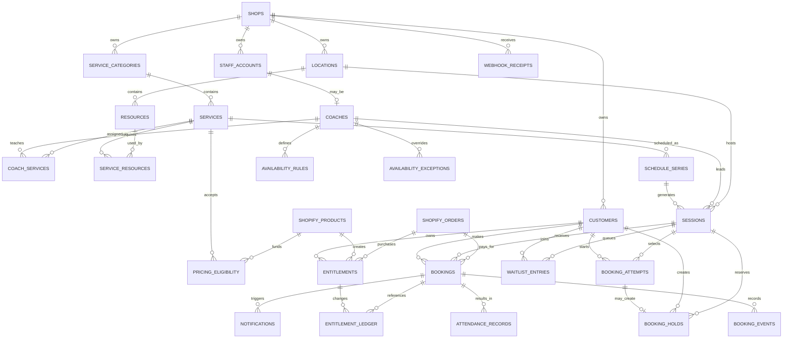

# Skyra Booking System — 数据模型与 ERD

## 最新功能批次：Appointment 直接确认、逐次留言与 Today（2026-09-13）

按用户最新决定，Appointment 无需 Admin/Coach 审批。Admin 发布容量为 1 的私教时段，用户使用有效 Pass 或经 Shopify 付款验证后直接确认。用户在每次 Booking Review 填写可选留言，老师在对应课程名册查看；不开发聊天、老师回复或课前/课后消息系统。Admin/Coach 首页新增 Today 课程与预约名单，目前使用内部客户引用，真实姓名仍待 Shopify 客户资料接通。

已先将上一批提交并推送至 bookingdev：`75ccf976d2946790a4a0d5ce3f2e2849cc09b9ea`，远程 SHA 一致，[CI 34742951745](https://github.com/robber-857/Skyra/actions/runs/34742951745) success。本轮 Appointment/留言/Today 代码仍在本地，尚未再次提交。

验证：23 个测试文件 / **308 项测试通过**；TypeScript、ESLint、生产构建、Prisma、Shopify app build 和 Customer UI validator revision 5 通过。开发/测试库均已应用 **12 条迁移**。Home/Programs 16 组浏览器场景，以及 Coach/Customer 390/1440px 检查通过；这些不是 Shopify 真实账号、支付或邮件验收。

当前边界：使用 Admin 预发布的固定私教时段；Coach recurring availability/time off、动态时段和独立资源管理未完成。确认会生成 Customer/Coach 邮件任务，但 provider 与真实收件人未接通。Checkout/online bookings/owned Pass 三个公开开关仍关闭。银行、商户身份和邮箱由经营者之后配置；支付只使用 Shopify，资金退款由 Admin 线下处理。

详见 [Appointment 与课程留言](appointment-and-comments.md)、[最新交接](handoff-2026-09-13.md)、[真实 UAT](launch-readiness-and-uat.md)。以下旧日期段落为历史记录，旧“未提交/未实现”以本节为准。

## 2026-09-13 已有 Pass 确认增量

迁移 `202609120008_owned_booking_confirmation` 为 Booking 增加可空、唯一的 `ownedAttemptId`。复合外键同时约束 Shop/Attempt/Session/Customer 一致；ownedAttemptId 与 checkoutId 互斥，已有 Pass 来源关联不可修改。已付款 Booking 继续使用 checkoutId + Order/Line，不伪造 A$0 订单。

已有 Pass 确认锁顺序为 Session → Attempt → Entitlement；同事务创建 Booking、RESERVE(-1 available/+1 reserved)、CONFIRMED、审计及两条通知。余额不足会回滚整笔事务；同 Attempt 重试返回原 Booking，更换 Pass 返回 IDEMPOTENCY_CONFLICT。另一 Attempt 对同一 Customer/Class 不重复预约。重放即使 Attempt 已过期也能返回现有结果。

result 接口严格绑定签名 Shopify Customer，按真实 Booking/PaidBookingResult/Outbox 状态返回 allowlist 的 status + bookingReference；不返回 Cart secret、Order GID、邮箱或客户 GID，不写入业务数据。RESERVE 保留在 reserved，签到后 CONSUME 属于下一轮。

线下退款由 Admin 执行；当前数据模型没有自动资金退款指令或已完成线下退款的假定事实，人工记录及权益调整待实现。

## 1. 数据所有权

| 领域 | 唯一可信来源 | 说明 |
| --- | --- | --- |
| 客户身份、邮箱、电话、地址 | Shopify Customer | Booking DB 只保存 `shopify_customer_gid` 与业务偏好，避免复制不必要的 PII |
| 商品名称、公开售价、税、折扣 | Shopify Product / Variant | 一个可销售的 Pass 或服务映射到一个 Variant |
| 支付、订单、退款 | Shopify Order | Booking DB 保存映射与同步状态，不保存银行卡数据 |
| 服务排期、Coach availability、场地资源 | PostgreSQL | 实时业务数据，需要事务和冲突检查 |
| Booking、Waitlist、取消、签到 | PostgreSQL | Booking Engine 的核心数据 |
| Pass 次数、预约占用、恢复、过期 | PostgreSQL | 使用不可变 ledger，余额由流水计算或投影 |
| 公开教练资料、服务展示补充字段 | Shopify app-owned Metaobjects / Metafields | 低频内容，适合 Storefront 读取 |

## 2. 核心 ERD



## 3. 核心表

### `shops`

| 字段 | 类型 | 规则 |
| --- | --- | --- |
| id | uuid | PK |
| shopify_shop_gid | text | UNIQUE, NOT NULL |
| shop_domain | text | UNIQUE, NOT NULL |
| timezone | text | 默认 `Australia/Sydney` |
| status | enum | ACTIVE / SUSPENDED / UNINSTALLED |
| created_at / updated_at | timestamptz | UTC |

即使当前只有一个店，所有业务表仍带 `shop_id`，避免以后增加门店或测试店时重构。

### `customers`

| 字段 | 类型 | 规则 |
| --- | --- | --- |
| id | uuid | PK |
| shop_id | uuid | FK |
| shopify_customer_gid | text | 每个 shop 内 UNIQUE |
| preferred_timezone | text | nullable |
| booking_status | enum | ACTIVE / RESTRICTED |
| waiver_status | enum | NOT_REQUIRED / REQUIRED / VALID / EXPIRED |
| created_at / updated_at | timestamptz | UTC |

不把邮箱和电话作为业务主键。需要发送通知时，按权限从 Shopify 读取或保存加密的通知快照。

### `staff_accounts`

| 字段 | 类型 | 规则 |
| --- | --- | --- |
| id | uuid | PK |
| shop_id | uuid | FK |
| identity_subject | text | 登录提供方的唯一 subject |
| role | enum | COACH / OPERATIONS / ADMIN |
| status | enum | INVITED / ACTIVE / DISABLED |
| display_name | text | NOT NULL |
| last_login_at | timestamptz | nullable |

### `coaches`

| 字段 | 类型 | 规则 |
| --- | --- | --- |
| id | uuid | PK |
| staff_account_id | uuid | UNIQUE FK |
| public_name | text | NOT NULL |
| bio | text | nullable |
| color | text | 日历颜色 |
| booking_buffer_before_min | integer | >= 0 |
| booking_buffer_after_min | integer | >= 0 |

### `service_categories`

- `id`, `shop_id`, `name`, `slug`, `sort_order`, `status`。
- 示例：Aerial Movement、Dance Classes、Personal Training、MV Filming。

### `services`

| 字段 | 类型 | 说明 |
| --- | --- | --- |
| id | uuid | PK |
| category_id | uuid | FK |
| type | enum | CLASS / APPOINTMENT / COURSE |
| name | text | 内部与公开名称 |
| duration_min | integer | 实际服务时长 |
| capacity | integer | 1:1 appointment 默认 1 |
| booking_mode | enum | INSTANT / REQUEST_APPROVAL / ADMIN_ONLY |
| min_booking_notice_min | integer | 最晚提前多久预约 |
| cancellation_cutoff_min | integer | 免费取消截止 |
| online_bookable | boolean | 是否在线公开 |
| shopify_product_mapping_id | uuid | 对应 drop-in Shopify Product/Variant，可空 |
| status | enum | DRAFT / ACTIVE / INACTIVE |

实现约束（2026-09-15）：`Service.kind` 只允许 `CLASS`、`APPOINTMENT`、`COURSE`。`APPOINTMENT` 容量固定为 1；`COURSE` 当前表示可按日期排入 Weekly Schedule 的 Workshop，并使用配置容量。已有 Session 或 Pass eligibility 的 Service 不能直接改 kind，应创建新 Service，避免历史预约和已售 Pass 改变语义。

### `coach_services`

- 多对多连接 Coach 与 Service。
- 可覆盖默认时长、价格映射和 buffer。
- 唯一约束：`(coach_id, service_id)`。

### `locations` 与 `resources`

- Location：Skyra Studio 等实体地点。
- Resource：Studio A、Studio B、Aerial Rig、Camera Set 等会产生冲突的资源。
- `service_resources` 定义某服务必须占用哪些资源及数量。

### `schedule_series`

用于 Class/Course 的重复排课模板：

- `service_id`, `coach_id`, `location_id`。
- `recurrence_rule`：例如每周三 18:30。
- `starts_on`, `ends_on`。
- `default_capacity`。
- `generation_horizon_days`：建议滚动生成未来 60–90 天 Session。

修改 Series 不直接覆盖已经有 Booking 的历史 Session。应选择“仅本次 / 本次及以后 / 全部未开始场次”。

### `sessions`

所有真正可被预约的时间实例：

| 字段 | 类型 | 说明 |
| --- | --- | --- |
| id | uuid | PK |
| series_id | uuid | Class/Course 可有，Appointment 可空 |
| service_id | uuid | FK |
| coach_id | uuid | FK |
| location_id | uuid | FK |
| starts_at / ends_at | timestamptz | UTC |
| local_timezone | text | 展示与 DST 计算 |
| capacity | integer | 当前场次容量快照 |
| status | enum | SCHEDULED / CANCELLED / COMPLETED |
| version | integer | 乐观锁版本号 |

当前 Appointment 使用 Admin 提前创建并发布的 ClassSession，Service.kind=APPOINTMENT，容量固定为 1；不在客户 Hold 时动态创建 Session。动态 availability、time off 和独立 Resource 分配仍待实现。

### 2026-09-12 已落库的 Class Booking 与 Entitlement 基础

当前 Prisma 已包含 `CustomerProfile`、`BookingAttempt`、`BookingHold`、`BookingCheckout`、`Booking`、`Entitlement` 与 `EntitlementLedgerEntry`。下面各表描述仍包含后续订单、完整 Booking 状态与 Customer/Coach 功能的目标字段；不要把这些后续字段当成已实现。

- CustomerProfile：保存 shop + Shopify Customer GID 映射，不保存密码；`(shopId, shopifyCustomerGid)` 唯一。2026-09-15 增加可选 preferred name、签名、训练目标与头像二进制/MIME。头像只允许 PNG/JPEG/WebP、文件头必须匹配且不超过 512 KiB；数据库约束要求 bytes/MIME 成对存在。Shopify 仍拥有正式姓名、邮箱、电话、地址和认证信息。
- BookingAttempt：`tokenHash` 唯一、Session、可空 Customer、HOME/PROGRAMS、状态、创建/更新/到期；默认 30 分钟。客户绑定后不可修改，shop/session/surface/tokenHash 同样不可换绑。当前状态为 LOGIN_REQUIRED / STARTED / HOLD_ACTIVE / RECOVERY / EXPIRED。
- BookingHold：每个 Attempt 最多一条，包含 Customer/Session、purchaseKind、可空 PassPlan、idempotencyKey、15 分钟期限、ACTIVE/CONSUMED/EXPIRED/RELEASED。NEW_PASS 必须指向 PassPlan；DROP_IN 不接受 PassPlan，购买商品从 Session 对应 Service 推导。每店每客户 idempotencyKey 唯一；ACTIVE 的同客户同场次唯一。复合外键保证 Hold 与 Attempt 的店铺/课程/客户完全一致。
- BookingCheckout：每个 Hold 最多一条。保存服务器生成的随机 reference、已核对的 Product/Variant/价格和 catalog fingerprint，以及 CREATING / READY / UNKNOWN / REJECTED / INVALIDATED 状态。完整 Cart ID（含 secret key）仅保存在服务器，不能进入 API、审计或前端；Cart 创建结果未知时停止自动重建，避免重复 Cart/付款。数据库禁止换绑上下文、改写已知 Cart ID 或删除创建历史。
- Booking：本轮仅实现 shop/customer/session/status/createdAt 容量投影；尚未连接订单、权益和确认接口。CONFIRMED 的同客户同场次唯一。
- Entitlement：绑定 shop/customer/PassPlan/ProductMapping 与唯一 Shopify Order + Line Item 来源，记录使用窗口、初始次数和 ACTIVE/EXPIRED/REVOKED 状态；来源、归属、期限与初始次数不可改写。
- EntitlementLedgerEntry：只追加、不更新/删除。每条同时记录 available/reserved/consumed delta：GRANT 增加 available；RESERVE 从 available 移到 reserved；CONSUME 从 reserved 移到 consumed；RELEASE 从 reserved 退回 available；ADJUST、EXPIRE、REVOKE 保留原因和幂等键。数据库锁行并阻止任一余额为负。
- SQL 触发器统一锁定 ClassSession 行，检查 Hold + confirmed Booking 总数和同客户占用；阻止直接 SQL 超卖及把 capacity 下调到已占数量以下。
- 过期 Hold 无须等待 Worker 就从 availability 排除；Worker/创建 Hold/恢复 Attempt 时可把它标为 EXPIRED。创建/绑定/释放/到期使用既有不可变 AuditLog；目标 `booking_events` 独立表仍待后续阶段。
- 新迁移：`202609120002_entitlement_ledger_drop_in_hold`、`202609120003_entitlement_hold_immutability`、`202609120004_booking_checkout` 与 `202609120005_order_paid_inbox`，已应用到专用测试库和 `127.0.0.1:55432/skyra_booking` 本地开发库。

### `booking_attempts`

连接 Home/Programs 同一区块状态机与 Shopify 登录/Checkout 返回流程。它保存服务器可验证的恢复上下文，而不是保存客户输入的可信结果：

| 字段 | 类型 | 说明 |
| --- | --- | --- |
| id | uuid | PK，内部 ID |
| public_token_hash | text | UNIQUE；浏览器只持有随机 opaque token，数据库保存 hash |
| shop_id | uuid | FK |
| customer_id | uuid | nullable，登录后绑定且不可换绑 |
| session_id | uuid | FK |
| surface | enum | HOME / PROGRAMS |
| selected_pass_plan_id | uuid | nullable |
| status | enum | STARTED / LOGIN_REQUIRED / PASS_SELECTED / CHECKOUT_STARTED / PROCESSING / CONFIRMED / RECOVERY / EXPIRED |
| hold_id | uuid | nullable FK |
| booking_id | uuid | nullable FK |
| expires_at | timestamptz | 短期恢复窗口 |
| created_at / updated_at | timestamptz | UTC |

约束：

- 返回路径由 `surface` 映射到固定的 Shopify 路径，禁止保存或跳转到任意外部 URL。
- 登录后必须把 attempt 与经 App Proxy 验证的 Shopify Customer 绑定；不能相信浏览器提交的 Customer ID。
- 客户端显示的 BROWSE / DETAILS / PASS_SELECTION 属于 UI 状态，数据库只保存跨登录、Checkout 和 Webhook 必需的服务端状态。
- Attempt 到期后不能继续扣次或确认 Seat；已有付款仍按订单规则创建 Entitlement，并进入 RECOVERY。

### `booking_holds`

| 字段 | 类型 | 说明 |
| --- | --- | --- |
| id | uuid | PK，Booking 内部 Hold ID；不会直接传入 Shopify Cart |
| attempt_id | uuid | UNIQUE nullable FK，购买新 Pass 时关联恢复流程 |
| customer_id | uuid | FK |
| session_id | uuid | FK |
| quantity | integer | 通常 1 |
| expires_at | timestamptz | 15 分钟 |
| status | enum | ACTIVE / CONSUMED / EXPIRED / RELEASED |
| idempotency_key | uuid | 防止重复点击 |

### `booking_checkouts`

| 字段 | 类型 | 说明 |
| --- | --- | --- |
| id | uuid | PK，内部 checkout intent ID |
| shop_id / hold_id | uuid | 复合 FK；每个 Hold 只能有一条创建记录 |
| product_mapping_id | uuid | 复合 FK，服务器推导的商品映射 |
| reference | text | 32 字节随机 opaque 值，Cart line attribute `_skyra_booking_ref`；不含客户 PII |
| product_gid / variant_gid | text | 创建前核对并冻结的 Shopify 目标 |
| price_cents | integer | 创建前核对并冻结的 AUD 价格 |
| catalog_fingerprint | sha256 | Shop/商品/Session 关键版本快照，网络前后需一致 |
| status | enum | CREATING / READY / UNKNOWN / REJECTED / INVALIDATED |
| cart_id | text | nullable；含 secret key，仅服务器保存和回读，永不返回浏览器或审计 |

当前公开 Checkout 路由仍由编译期能力开关关闭。内部编排在创建 Hold 前和 Cart 返回后重新检查身份、预约窗口、容量、资格及 catalog；Shopify 网络请求期间不持有 Session/Attempt 数据库锁。`cartCreate` 禁用 SDK 自动重试并有 6 秒截止；同一 Hold 的并发/重复请求只允许一次创建 claim。已知 Cart 可只读回查，未知创建结果不自动创建第二个 Cart。

### `bookings`

| 字段 | 类型 | 说明 |
| --- | --- | --- |
| id | uuid | PK |
| reference | text | 人类可读，例如 `BK-20260903-0142` |
| customer_id | uuid | FK |
| session_id | uuid | FK |
| hold_id | uuid | nullable FK |
| shopify_order_gid | text | nullable |
| status | enum | 见状态机 |
| source | enum | CUSTOMER / ADMIN / COACH / IMPORT |
| booked_at | timestamptz | UTC |
| cancelled_at | timestamptz | nullable |
| cancellation_reason | text | nullable |

活动 Booking 唯一约束要覆盖同一客户不能重复占用同一个 Session。

### `booking_events`

不可变审计流水：

- `booking_id`, `event_type`, `actor_type`, `actor_id`。
- `from_status`, `to_status`。
- `metadata jsonb`。
- `created_at`。

Booking 当前状态是投影，事件记录用于追溯谁在何时执行了改期、取消、退款或签到。

### 每次 Booking 的客户留言

按 2026-09-13 用户确认范围，原 coach_messages / PRE_CLASS / POST_CLASS / visibility 模型取消，不创建消息表。

- Prisma `BookingAttempt.customerComment`：客户本人当前预约草稿，默认空文本，最多 1000 字符；禁止控制字符（保留换行与 tab）。
- Prisma `Booking.customerComment`：确认时复制的不可修改快照；改期新 Booking 保留原留言。
- 保存须 signed App Proxy + 当前登录归属验证；只允许 STARTED、未过期且尚未创建 Hold 的草稿。相同值重试幂等。
- 老师仅可在自己所带 Session 的名册读对应客户留言；Admin 在预约详情查看；Customer Account 只显示本人留言。
- 正文不写 Shopify、订单、Outbox、邮件、审计 metadata 或 Today 列表。按纯文本渲染，不解释 HTML。
- 第 12 条迁移 `202609130011_appointment_comments` 同时约束 Appointment 容量=1、已排期 Service kind 不可变和 Booking 留言快照不可变。

### `waitlist_entries`

- 状态：WAITING / OFFERED / ACCEPTED / DECLINED / EXPIRED / REMOVED。
- 保存 `position`, `offered_at`, `offer_expires_at`。
- Session 出现空位时按顺序发 offer，不直接自动扣款。

### `shopify_product_mappings`

保存 Booking 定义与 Shopify 可销售商品的映射和同步快照：

- `shopify_product_gid`, `shopify_variant_gid`。
- `owner_type`, `owner_id`：SERVICE / PASS_PLAN。
- `kind`: DROP_IN / SINGLE_PASS / PACK / MEMBERSHIP / APPOINTMENT_PACKAGE。
- `session_count`, `validity_days`。
- `sync_status`: PENDING / SYNCING / SYNCED / ERROR。
- `requested_version`, `shopify_version`, `last_error`, `last_synced_at`。
- 唯一约束：同一个 `shop_id + owner_type + owner_id` 只有一个活动映射。

价格仍以 Shopify Variant 为准，不在这里形成第二套价格真相。

### `pricing_eligibility`

定义哪个 Shopify Variant 可以支付哪些 Service：

- `shopify_product_mapping_id`, `service_id`。
- 可选限制：首次客户、指定时间段、指定 Location。
- 唯一约束：`(shopify_product_mapping_id, service_id)`。

### `entitlements`

一笔购买产生的可使用权益：

| 字段 | 类型 | 说明 |
| --- | --- | --- |
| id | uuid | PK |
| customer_id | uuid | FK |
| shopify_product_mapping_id | uuid | FK |
| shopify_order_gid | text | 来源订单 |
| starts_at / expires_at | timestamptz | 使用窗口 |
| granted_units | integer | 总次数 |
| status | enum | PENDING / ACTIVE / EXPIRED / REVOKED |

### `entitlement_ledger`

不要直接修改一个 `remaining_sessions` 数字而没有历史。流水类型：

- GRANT：购买后增加次数。
- RESERVE：Booking confirmed 时预留次数。
- CONSUME：上课完成或 Late Cancel/No-show 时正式消耗。
- RELEASE：按规则取消后释放预留次数。
- ADJUST：Admin 手工调整，必须附原因。
- EXPIRE：到期结转为不可用。
- REVOKE：退款或 chargeback 撤销。

实现使用三个正交投影：`available = Σ available_delta`、`reserved = Σ reserved_delta`、`consumed = Σ consumed_delta`。RESERVE 写 `(-1,+1,0)`，CONSUME 写 `(0,-1,+1)`，RELEASE 写 `(+1,-1,0)`，因此同一预留从 reserved 转为 consumed 时不会再次减少 available。

### `webhook_receipts`

- 当前已落库字段为 `shop_id`, `webhook_id`, `topic`, `payload_hash`, `status`, `received_at`；不保存原始订单、邮箱、地址或银行卡数据。
- 当前状态约束：RECEIVED / QUEUED / PROCESSED / NEEDS_ATTENTION / FAILED；`status + received_at` 有运维索引。
- 唯一约束 `(shop_id, webhook_id)` 在并发事务下去重；相同 ID 只有 topic 与原始 payload SHA-256 都一致才作为安全重放。
- `orders/paid` 无 Booking reference 时标记 PROCESSED；合法关联进入 `ORDER_PAID_RECEIVED` Outbox，畸形、跨店或 Customer/Product/Variant/数量/AUD 金额/付款状态不匹配进入 `ORDER_PAID_REVIEW`。
- 当前 Outbox 只保存 Receipt/Order/Line/Checkout opaque ID 和错误代码，不保存 Customer GID。Worker 成功后的 Receipt 状态推进、attempt_count/last_error、Admin 重放与 reconciliation 仍是后续字段/功能。

## 4. 并发和防超卖规则

### Class 容量

在同一数据库事务内：

1. 锁定目标 `sessions` 行。
2. 计算未过期 Hold + 活动 Booking 数量。
3. 仅当占用量小于 capacity 时插入 Hold。
4. 使用 `idempotency_key` 防止双击创建两个 Hold。

### Appointment 时间冲突

预约占用范围必须包含：

```text
starts_at - coach.buffer_before
到
ends_at + coach.buffer_after
```

数据库层禁止同一个 Coach、Location 或独占 Resource 的活动 Appointment 时间重叠。应用层检查用于友好提示，数据库约束负责最终安全。

### 改期

改期不是直接修改旧 Session：

1. 为新 Session 建立 Hold。
2. 新名额成功后创建 RESCHEDULE 事件。
3. 将 Booking 指向新 Session，释放旧占用。
4. 整个过程在一个事务中完成。

## 5. Shopify 自定义数据

### 先定义 Schema

建议使用 `shopify.app.toml` 定义 app-owned 数据：

| 定义 | Owner / Type | 用途 |
| --- | --- | --- |
| `booking_service_id` | Product metafield | Shopify Product 到 PostgreSQL Service 的稳定映射 |
| `entitlement_kind` | Product metafield | SINGLE_PASS / PACK / MEMBERSHIP |
| `$app:coach_profile` | Metaobject | 公开姓名、头像、简介、专长 |
| `$app:booking_service_content_v1` | Metaobject | 公开说明、难度、准备事项、取消政策摘要 |

Product Metafield 定义由 App 版本控制。版本化 Service content Metaobject definition 由 Worker 使用 `metaobjectDefinitionCreate` 幂等确保；需要商家编辑的值开放 `merchant_read_write`，只有公开内容开放 Storefront 读取。

### 再写入值

- Metafield 值统一通过 Admin API `metafieldsSet` 写入。
- Metaobject 条目统一通过 `metaobjectUpsert` 写入。
- 数据关系使用 reference 类型，不把相关对象 ID 塞进普通文本字段。

### 最后读取

- Storefront 读取公开 Coach/Service 内容。
- Admin App 读取映射和同步状态。
- Booking Backend 不依赖 Metaobject 完成实时容量、冲突或扣次判断。

## 6. 状态枚举

### Booking

```text
HELD
PENDING_PAYMENT
REQUESTED
CONFIRMED
WAITLISTED
COMPLETED
RESCHEDULED
CANCELLED
LATE_CANCEL
NO_SHOW
PAYMENT_FAILED
REFUND_PENDING
REFUNDED
EXPIRED
```

### Payment projection

```text
NOT_REQUIRED
PENDING
PAID
PARTIALLY_REFUNDED
REFUNDED
FAILED
DISPUTED
```

支付状态是 Shopify Order 的本地投影，不能代替 Booking 状态。

## 7. 保留与隐私

- 数据库存 UTC，界面按 Location timezone 显示。
- 不保存银行卡、Shopify access token 到日志或 Booking metadata。
- Coach 只能读取其被分配 Session 所需的最少客户字段。
- 健康信息、Waiver 和内部备注需单独授权、加密并记录访问审计。
- 客户删除与数据请求必须传播到 Booking 数据保留流程。
- PostgreSQL 开启自动备份和 point-in-time recovery；Webhook 失败队列需可重放。

## 2026-09-12 实际模型增量

- BookingCheckout.purchaseTerms：不可变 JSON v1，冻结 credits/validityDays/timezone/Session 时间/Coach/Location/Service。历史 null 进入人工检查。
- Entitlement.passPlanId 改为 nullable，新增 serviceId；Pass 与 Service Drop-in 目标必须二选一，Drop-in grantedUnits=1；归属和来源不可变。
- Booking 增加 checkoutId/sourceOrderGid/sourceLineItemGid，单 Checkout 和同店 Order-Line 唯一；跨店 FK 和来源不可变。Attempt 增加 CONFIRMED，过期 sweep/resume 不再降级已确认状态。
- PaidBookingResult：checkoutId 唯一、同店 Order-Line 唯一；记录 Entitlement/Booking 引用和 CONFIRMED/NEEDS_ATTENTION、原因；确保恢复失败后重试也不重复发权益。
- BookingNotification：同店 Booking + 收件角色/内部 ID + template 唯一，PENDING/SENDING/ACCEPTED/FAILED/UNKNOWN/SUPPRESSED；attempts、availableAt、claimedAt、acceptedAt、providerMessageId、lastError。没有邮箱、原始订单、Customer GID 或正文。
- CoachAccessToken：同店 Coach 关联，tokenHash 唯一；LOGIN/SESSION、ACTIVE/CONSUMED/REVOKED、expiresAt；原始 token 只作为登录/会话凭证，不落日志或数据库。
- Coach 查询按当前身份与 Session.startsAt 过滤，跨店/其他 Coach 不可查询；Shop timezone 定义日期区间，Session timezone 定义显示。

当前通知合同与状态语义见 [Booking 邮件与 Coach](notifications-and-coach.md)。
