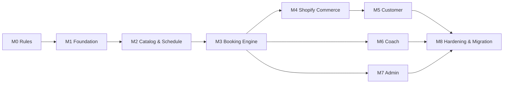

# Skyra Booking System — V3 开发规划与 MVP 任务清单

## 1. MVP 目标

第一版必须完成一个可真实运营的闭环：

```text
Admin 配置服务与排期
→ Customer 查看 Class / Appointment availability
→ 使用已有 Pass 或 Shopify Checkout 付款
→ 系统确认 Booking
→ Customer 与 Coach 查看日程
→ Coach 签到
→ Admin 取消、改期、退款与查错
```

### 已批准的交付形态

- Home 与 Programs 都显示 Program 风格的 Find a Class，并复用同一个 Booking 组件与 API。
- BROWSE、DETAILS、LOGIN_REQUIRED 提示、PASS_SELECTION、CONFIRMING、CONFIRMED、RECOVERY 都在当前 Booking section 内切换。
- Shopify Customer Account 登录和 Shopify Checkout 是仅有的外部页面；返回时通过 opaque Booking attempt 恢复原页面、Session 和状态。
- 使用已有 Pass 不创建 A$0 订单；购买新 Pass/drop-in 才创建 Hold、进入 Checkout，并由 orders/paid Webhook 完成 Entitlement 与 Booking。
- 当前 Home 静态 Preview、Programs 静态日程和所有 Mindbody Book 链接必须在上线前移除，不得与实时组件并存。

## 2. MVP 范围

### P0 — 上线必须有

- Customer：Shopify Home + Programs 同区块 Booking、My Overview、My Passes、Bookings & History、Appointments、取消/改期与老师留言。
- Commerce：Single Pass、次数 Pack、Shopify Cart/Checkout、Discount、Order、Refund 映射。
- Admin：Overview、People、Classes & Passes、Weekly Schedule、Bookings、Reports；Settings 为低频入口。
- Coach：Today、Schedule、Roster、Appointment Detail、Attendance、Availability。
- Engine：容量锁、Appointment 冲突、Hold、Entitlement ledger、Webhook 幂等、通知。
- Operations：日志、失败队列、对账、备份、权限、旧系统数据迁移。

### P1 — MVP 稳定后

- 基础 Waitlist 与名额释放通知。
- Course 整期报名。
- Intro Offer 到期提醒。
- 基础利用率和 No-show 报表。
- Admin CSV 导出。

### P2 — 暂不进入 MVP

- 自动续费 Membership。
- 复杂家庭账号/代他人预约。
- 多门店跨店权益。
- 动态定价。
- AI at-risk / big spender prediction。
- 原生手机 App。
- 深度营销自动化。

## 3. 开发顺序与依赖



在 Booking Engine 规则稳定前，不应同时大规模开发三端页面，否则页面会反复返工。

### 3.1 当前主题迁移清单

| 文件 | 迁移动作 | 完成标准 |
| --- | --- | --- |
| shopify-theme/sections/skyra-home.liquid | 删除静态三条课与 preview box，保留设计外壳并加入 Home mount | 不再输出示例 availability |
| shopify-theme/sections/skyra-programs.liquid | 删除硬编码课程、Mindbody URL 和跳转式 Book 链接，加入 Programs mount | Book 进入同区块 DETAILS |
| shopify-theme/assets/skyra.js | 移除 home booking demo filter/preview handler | 不再包含 booking 示例数据 |
| shopify-theme/assets/skyra.css | 清理只服务旧 demo 的选择器；正式组件样式由 app extension 管理 | 卸载/禁用 app 时主题仍稳定 |
| Booking App theme extension | 新建 app embed、共享 bundle、mount bootstrap、App Proxy client | 两个页面运行同一 build |
| Booking App backend | availability、attempt、Pass eligibility、confirm、hold、Checkout return/status APIs | 所有 mutation 验证店铺与 Customer |
| Customer Account extension | My Overview、Passes、Bookings/History、Appointments | 使用 fresh session token 读取本人数据 |

Home 当前 section 已将唯一的 @app block 用于 Instafeed，因此 Booking 使用 app embed + 显式 mount，不把 Booking 塞进同一个 @app block，也不要求重写现有 Theme Editor 的 Instafeed 配置。

## 4. M0 — 业务规则冻结

预计开发量：2–3 个工作日的产品决策与验证。

### 任务

- [ ] M0-01 定义 Class、Appointment、Course、Pass、Booking 的产品术语。
- [ ] M0-02 确定 Class 最早/最晚预约时间。
- [ ] M0-03 确定免费取消、Late Cancel、No-show 规则。
- [ ] M0-04 确定扣次时机：Confirm 时 Reserve，Complete/Late Cancel/No-show 时 Consume。
- [ ] M0-05 确定提前取消是否恢复次数。
- [ ] M0-06 确定 Appointment 哪些 Instant、哪些 Request Approval、哪些 Admin Only。
- [ ] M0-07 确定 Appointment 是否允许 Any available coach。
- [ ] M0-08 建立 Service ↔ Pass eligibility 初始矩阵。
- [ ] M0-09 确定未来排期生成窗口，例如 60 或 90 天。
- [ ] M0-10 确定客户通知渠道、模板与发送时间。

### 验收

- 所有规则有唯一结论，不留“开发时再决定”。
- 用至少 5 个真实场景走通：新客 Drop-in、已有 10 次卡、提前取消、Late Cancel、私教改期。

## 5. M1 — Shopify App 与工程基础

预计开发量：4–6 个工作日。

### 任务

- [ ] M1-01 创建 Shopify dev store 与 single-merchant Custom App。
- [ ] M1-02 使用 Shopify CLI 初始化官方 App 模板。
- [ ] M1-03 建立开发、测试、生产环境配置。
- [ ] M1-04 接入 PostgreSQL、migration、seed 与连接池。
- [ ] M1-05 建立 Redis/Queue 与 Worker。
- [ ] M1-06 实现 Shopify Admin App authentication。
- [ ] M1-07 实现 Customer Account Session Token 验证。
- [ ] M1-08 实现 Coach magic link/OTP 与 Staff RBAC。
- [ ] M1-09 建立统一日志、request ID、error monitoring。
- [ ] M1-10 建立 CI：lint、typecheck、unit test、migration check。
- [ ] M1-11 建立审计日志与敏感字段脱敏规则。

### 验收

- Admin、Customer、Coach 三种身份可以分别进入空白受保护页面。
- Customer A 无法读取 Customer B 数据。
- Coach 无法调用 Admin API。
- 生产 Secrets 不存在于仓库和前端 bundle。

## 6. M2 — Catalog、Pricing Mapping 与 Schedule

预计开发量：5–7 个工作日。

### 任务

- [ ] M2-01 实现 Service Category CRUD。
- [ ] M2-02 实现 Service CRUD：Class / Appointment / Course 类型。
- [ ] M2-03 实现 Coach、Location、Resource CRUD。
- [x] M2-04 实现 Coach ↔ Service assignment。
- [x] M2-05 实现 Service/Pass → Shopify Product/Variant 的 `productSet` upsert、映射表、Outbox、同步状态与重试。
- [x] M2-06 实现 Variant ↔ Entitlement definition ↔ Service eligibility 映射。
- [ ] M2-07 定义所需 app-owned custom data：Product Metafields 与 Service content definition 已完成；Coach profile 待完成。
- [ ] M2-08 使用 `metafieldsSet` 写入 Product 映射值，并用 Metaobject upsert 维护公开 Coach/Service 条目。
- [ ] M2-09 从 Admin/Storefront 读取并验证这些值。
- [ ] M2-10 实现 Class recurring schedule series。
- [ ] M2-11 实现未来 Session generation job。
- [ ] M2-12 实现 Coach recurring availability 与 time-off exception。
- [ ] M2-13 实现 Appointment slot calculation。
- [x] M2-14 交付可用的 Embedded Admin “Classes & Passes” vertical slice，让 Admin 能录入 Class/Pass 并查看 Shopify sync 状态。
- [x] M2-15 交付可用的 “Weekly Schedule” vertical slice，让 Admin 能按周选择实际日期、时间、Coach，完成冲突检查和 publish。

### 验收

- Admin 能创建一个 Class 并生成未来 8 周 Session。
- 在开发 Customer UI 前，测试数据必须来自上述 Admin 页面或 seed，不允许继续把示例课程硬编码到主题。
- 修改 Series 时能选择仅本次、本次及以后，不破坏历史 Booking。
- 一个 Appointment 候选时段同时满足 Coach、Location、Resource 与 buffer 条件。
- 停售 Shopify Variant 后不再作为新 Pass 选项出现。
- 每周排出的 dated Session 不会生成额外 Shopify Product；同一 Class 始终复用稳定映射。

## 7. M3 — Booking、Hold、冲突与 Entitlement Engine

预计开发量：7–10 个工作日。

### 任务

- [x] M3-01 实现公开 Class availability 查询：扣除 confirmed Booking 与未过期 ACTIVE Hold，no-store，并返回预约窗口状态；2026-09-10 PostgreSQL/HTTP 验证通过。
- [ ] M3-02 实现 Appointment availability 查询。
- [x] M3-03 实现 15 分钟 Booking Hold 内部服务：认证/归属、Pass 适用性/有效期、Drop-in Session 商品推导和店铺开关校验；创建 Cart 与公开交易入口属于 M4，当前未开放。
- [x] M3-04 实现 Hold idempotency、释放与自动过期：重试不延长 TTL；过期立即不计入容量；Worker 每 30 秒清理，事件幂等。
- [x] M3-05 实现 Class capacity 事务锁和数据库触发器：20 人抢最后一个名额、20 个直接数据库写入均仅 1 个成功；容量不得低于已占用数量。
- [ ] M3-06 实现 Coach/Location/Resource 时间重叠约束。
- [ ] M3-07 实现 Booking 状态机。当前只有容量投影表和 Attempt/Hold 状态，确认/取消/签到仍未实现。
- [ ] M3-08 实现 Booking Event audit trail。Attempt 创建/绑定及 Hold 创建/释放/到期已有追加式审计；完整 Booking 事件未实现。
- [x] M3-09 实现 Entitlement grant/reserve/consume/release/adjust/revoke ledger：追加式三余额流水、来源订单行与操作幂等、数据库非负约束及不可变触发器已完成；尚未接 orders/paid 或 Booking 状态机。
- [x] M3-10 实现有效 Pass 选择算法：按 Customer/Service/有效期/可用余额筛选并按最早到期排序；Intro 使用保守首次客户规则。Storefront 已有 Pass 卡片与原子确认仍属 M5-07/M5-09。
- [ ] M3-11 实现原子改期：新 Hold 成功后再释放旧占用。
- [ ] M3-12 实现取消政策计算。
- [ ] M3-13 实现 Admin 手工 Booking。
- [ ] M3-14 实现 Booking attempt：opaque token hash、HOME/PROGRAMS 固定返回路径、登录后 Customer 原子绑定、跨店/跨客户隔离、30 分钟恢复及到期已完成；前端已使用服务器恢复，Checkout/Webhook 状态尚待 M4，保持部分完成。

### 验收

- 对最后一个 Class 名额发送 20 个并发请求，最多只成功 1 个。
- 同一个 Customer 双击 Book 只产生 1 个活动 Hold/Booking。
- 同一个 Coach 不会出现 buffer 后仍重叠的 Appointment。
- 合规取消恢复预留次数；Late Cancel/No-show 不恢复。
- 改期失败不会丢失原预约。

## 8. M4 — Shopify Cart、Checkout、Order 与 Refund

预计开发量：7–10 个工作日。

### 任务

- [ ] M4-01 根据适用 Pass Variant 创建/更新 Shopify Cart。
- [ ] M4-02 将 opaque booking hold reference 写入 Cart line attributes。
- [ ] M4-03 确认预约摘要进入 Order 但不包含敏感数据。
- [ ] M4-04 订阅并验证订单、付款、取消、退款 Webhooks。
- [ ] M4-05 建立 `webhook_receipts` 去重和异步处理。
- [ ] M4-06 `orders/paid` 后发放 Entitlement 并 Confirm Booking。
- [ ] M4-07 重复 Webhook/Worker retry 不重复发 Pass 或 Booking。
- [ ] M4-08 退款后执行 Entitlement reversal 与 Booking projection 更新。
- [ ] M4-09 实现付款已完成但 Hold 异常的 Needs Attention 队列。
- [ ] M4-10 实现订单 reconciliation job 与 Admin 手工 Reconcile。
- [ ] M4-11 使用 Cart checkoutUrl 进入原生 Checkout，并把 Checkout/Thank-you 后续入口返回到原 Home/Programs Booking section；返回参数只携带 opaque attempt token。

### 验收

- Shopify 测试支付成功后只生成 1 个 Entitlement 与 1 个 Booking。
- 同一 Webhook 重放 5 次，数据库结果不变。
- 未付款 Checkout 不产生 Confirmed Booking，Hold 到期释放。
- Refund 后权益和 Booking 按规则更新，并保留审计记录。

## 9. M5 — Customer Experience

预计开发量：8–11 个工作日。

本阶段先交付 Home / Programs 内的客户下单模块。2026-09-09 提供的 Find a Class、Select a pass、Your cart 截图只约束该交易流程；Customer Account 的 My Bookings / My Passes 是后续独立界面。

### 任务

- [x] M5-01 创建 Theme App Extension app embed，加载一份版本化 Booking JS/CSS，自动挂载所有 `data-skyra-booking-root` 节点。
- [x] M5-02 Home：用 `data-surface="home"` 占位节点替换静态 “Booking that feels like Skyra” rows、preview UI 与相关 demo JavaScript。
- [x] M5-03 Programs：用 `data-surface="programs"` 占位节点替换硬编码 Find a Class 和所有 Mindbody Book/filter/date links。
- [ ] M5-04 完成共享 BROWSE：按 Programs Find a Class 视觉实现月标题、七日日期条、前后周、Class type/Instructor filters、实时容量、loading/empty/error 和区块内 Full calendar。七日条、筛选和实时 Session 已联调；本轮补充独立 Book 与 Show details，2026-09-11 已完成 Programs 共享宽面板、31 天 Full Calendar 和跨月选择；本轮已补齐月份标题、独立前后周与未开放文案；剩余真实 Programs 入口及完整 E2E。
- [ ] M5-05 完成 DETAILS：Show details 在 Session 行内展开或在同一 surface 替换内容，显示课程、老师、地点、level、policy、剩余名额；Back 恢复日期、筛选、滚动和焦点。
- [ ] M5-06 完成 LOGIN_REQUIRED：Shopify 登录 modal 与全端同页顶层跳转已实现，并已接服务器 opaque Attempt 与固定返回路径；签名身份绑定、无 storage 恢复通过本地验证。2026-09-12 用户反馈 Shopify 托管页 **Continue with Shop** 点击后疑似无响应；已移除桌面弹窗层，并修复本地预览误把登录请求发到 `127.0.0.1` 的 401。当前已验证开发店域名能在同一标签页打开 Shopify 托管登录并保留 `preview_theme_id`，但真实账户完成登录、退出、跨域 cookie 与签名返回仍待用户复测，保持部分完成。
- [ ] M5-07 完成 PASS_SELECTION：采用参考图的主栏 Pass cards + 右栏 Booking Details；已有适用 Pass 优先显示余额、到期与 `A$0 due today`，购买选项显示已同步 Shopify Variant 实时价格，未选择时 Continue 禁用。2026-09-11 已完成新 Pass cards、资格/同步价格检查和响应式 Booking Details；2026-09-12 已补充 Drop-in 卡片与价格复核；已有 Pass/最终 Shopify 可售校验待接。
- [ ] M5-08 新增 REVIEW：采用参考图的交易摘要结构，显示 Customer、Class、日期时间、Coach、Location、选中 Pass/Drop-in、价格与 Edit；这是当前 Booking section 的状态，不是 Customer Account 或独立 Cart 页面。2026-09-11 已完成新 Pass 摘要、服务端价格/名额复核及 Edit；2026-09-12 已补充 Drop-in 摘要；Customer/已有 Pass 与支付交接未完成。
- [ ] M5-09 已有 Pass 从 REVIEW 走原子确认并显示 CONFIRMING → CONFIRMED，不创建 A$0 Checkout。
- [ ] M5-10 新 Pass/Drop-in 从 REVIEW 创建 15 分钟 Hold、写 Cart line attribute，并通过 `checkoutUrl` 进入原生 Shopify Checkout；Booking App 不渲染支付表单。
- [ ] M5-11 Checkout 返回后恢复 attempt，显示 webhook processing、confirmed、payment complete but seat unavailable、Needs Attention 和 retry/recovery。
- [ ] M5-12 Home 与 Programs 的 UI、状态机、API client、analytics 与错误文案只实现一次；`data-surface` 仅控制标题、介绍文案或初始筛选。
- [ ] M5-13 完成 320–430px 与桌面验收：手机单列、日期横滑、Session 信息分组、全宽 Book/Continue、Booking Details 可折叠、44px touch target、安全区、键盘焦点、ARIA live、浏览器 Back、重复点击和零横向溢出。

Customer Account 后续独立交付，不使用本轮交易截图作为页面结构：

- [ ] M5-14 Customer Account full-page：My Overview，显示 Pass、下一节 Class/Appointment、快捷操作和最新老师留言。
- [ ] M5-15 Bookings & History：Upcoming、Attended、Cancelled、Late Cancel、No-show 与 Pass 来源。
- [ ] M5-16 Class/Booking Detail：Add to calendar、Cancel、Reschedule、Customer-visible coach message。
- [ ] M5-17 My Passes：余额、Reserved、Expiry、Eligibility、Usage history 与 Shopify order link。
- [ ] M5-18 Appointments：Service/Coach/slot、已有 Pass、Checkout hand-off、Upcoming/History 与老师留言。
- [ ] M5-19 Customer Account session token 获取与后端 JWT 验证，不信任浏览器提交的 Customer ID。
### 验收

- 新客可以完成“选课 → 登录 → 买 Drop-in → 付款 → 查看 Booking”。
- Book 每次重新验证 Shopify 登录；登录成功可被网站/Account 共用，退出后再次 Book 不能复用旧状态。未登录 modal、关闭、重复点击、校验失败、全端同页返回、无 storage 恢复及延迟响应取消均需覆盖；真实账户还需复测 Shopify 托管页 **Continue with Shop**。
- 只把 signed App Proxy 重新验证成功视为登录完成；储存的 selection、页面返回或浏览器传入 authenticated 不得放行。
- 老客可以使用有效 10 次卡预约而不重复付款。
- Home 和 Programs 的 Booking 步骤不会导航到自建详情/Pass/确认页面；只有 Shopify 登录和 Checkout 会离开，返回后恢复到正确状态。
- Home 和 Programs 显示同一组实时 Session、余额和容量结果，且代码中只有一份 Booking 状态机。
- 页面中不存在 Mindbody URL、静态假 availability 或旧 preview handler。
- Customer Account 能看到正确余额、到期日、Booking/Appointment 历史和只对客户公开的老师留言。
- 手机 320–430px 无横向溢出，关键操作不被遮挡。
- 客户只能取消或改期自己的 Booking。

## 10. M6 — Coach Portal

预计开发量：4–6 个工作日。

### 任务

- [ ] M6-01 Coach Today dashboard。
- [ ] M6-02 Day/Week schedule。
- [ ] M6-03 Class Session roster。
- [ ] M6-04 Check-in、Attended、No-show。
- [ ] M6-05 Appointment detail 与有限客户信息。
- [ ] M6-06 Availability recurring hours。
- [ ] M6-07 Time off / exception。
- [ ] M6-08 Schedule change notifications。
- [ ] M6-09 Coach 数据访问审计。
- [ ] M6-10 Coach 创建 PRE_CLASS/POST_CLASS 留言，并明确选择 Customer-visible 或 Internal。

### 验收

- Coach 只能看到分配给自己的 Session 和 Appointment。
- Coach 无法看到完整客户消费、营销标签、退款或其他 Coach 私有排期。
- Attendance 更新后 ledger 和 Booking status 正确变化。
- Customer Account 绝不显示 Internal coach note；已发布的 Customer-visible message 能关联到正确 Booking/Appointment。

## 11. M7 — Admin App

预计开发量：7–9 个工作日。

### 任务

- [ ] M7-01 Overview：today schedule、booking exception、逐 Customer Pass expiry alert。
- [ ] M7-02 People：一个页面内分 Customer / Coach 区域；Customer 显示 Pass、余额、到期、消费、下次预约，Coach 显示权限、可教课程、availability、weekly load。
- [ ] M7-03 Classes & Passes：一个页面创建/编辑 Class 与 Pass；Class 包含名称、drop-in price、duration、capacity、location、eligible coaches 和 suggested defaults。
- [ ] M7-04 Pass package：Shopify Variant price mapping，加 Booking DB credits、validity、eligible classes、online sale state。
- [ ] M7-05 Weekly Schedule：周 Calendar、copy last week、actual date/time/coach、conflict detection、draft/publish。
- [ ] M7-06 Bookings：index、saved filters、detail panel；Admin 创建、改期、取消、waitlist、attendance。
- [ ] M7-07 Booking detail 同页显示 Customer、Session、Payment/Pass、Entitlement、Timeline。
- [ ] M7-08 Reports：per-customer spending CSV 与 purchased-but-unused Pass credits/expiry CSV。
- [ ] M7-09 Refund、Restore Credit、Cancel 是三个分离动作，危险操作二次确认并记录原因。
- [ ] M7-10 Settings：notifications、locations/resources、policy、roles、integration health、failed webhook/reconcile、audit。

### 验收

- Operations 从 Weekly Schedule 能完成本周排课，从 Bookings 能完成客户预约管理，不需要直接操作数据库。
- Admin 主导航只有 Overview、People、Classes & Passes、Weekly Schedule、Bookings、Reports；Settings 为低频入口。
- Class 定义与 dated Session 分离：Weekly Schedule 才能决定实际日期、时间和 Coach。
- Reports 可以分别导出 Customer 消费与未用完 Pass，不要求 Admin 手工合并 Shopify 和 Booking 数据。
- Refund、Credit restore、Cancel 是三个明确动作，不会误触发。
- 所有修改记录 actor、时间、前后状态与原因。

## 12. M8 — 通知、测试、迁移与上线

预计开发量：7–10 个工作日。

### 通知

- [ ] M8-01 Booking confirmation。
- [ ] M8-02 Reminder。
- [ ] M8-03 Reschedule/cancellation。
- [ ] M8-04 Appointment request accepted/rejected。
- [ ] M8-05 发送失败重试与通知日志。

### 测试

- [ ] M8-06 Booking 状态机 unit tests。
- [ ] M8-07 Availability 和 cancellation policy unit tests。
- [ ] M8-08 PostgreSQL transaction/concurrency tests。
- [ ] M8-09 Shopify Webhook replay integration tests。
- [ ] M8-10 三端权限 integration tests。
- [ ] M8-11 Customer 购买和预约 E2E。
- [ ] M8-12 Admin 改期/取消/退款 E2E。
- [ ] M8-13 时区与澳洲夏令时边界测试。
- [ ] M8-14 Accessibility、mobile、browser smoke tests。

### 旧系统迁移

- [ ] M8-15 导出并盘点旧系统 Staff、Service、Pricing、Customer、Pass、Future Booking。
- [ ] M8-16 建立旧 ID → 新 UUID / Shopify GID mapping table。
- [ ] M8-17 清洗重复客户，禁止用姓名作为唯一键。
- [ ] M8-18 Dry-run import 到测试环境并输出行数与错误报告。
- [ ] M8-19 由业务人员抽查客户、余额、未来预约。
- [ ] M8-20 制定 cutover：冻结旧系统写入、最终增量导出、导入、对账、切换入口。
- [ ] M8-21 保留只读旧系统窗口与回滚方案。

### 上线验收

- 并发容量和 Appointment 冲突测试通过。
- 支付、退款、重复 Webhook、漏 Webhook 对账通过。
- 三种角色的越权测试通过。
- 迁移总数、余额总数、未来 Booking 数量与旧系统对账。
- 自动备份、恢复演练、告警和 Runbook 完成。

## 13. 建议工期

以 1 名熟悉 Shopify 的全栈开发者为基准，这个 P0 MVP 大约是 50–70 个有效开发日，不含长时间等待 Shopify 权限审批、内容录入和业务确认：

| 模块 | 有效开发日 |
| --- | ---: |
| 规则和基础 | 6–9 |
| Catalog / Schedule | 5–7 |
| Booking Engine | 7–10 |
| Shopify Commerce | 6–8 |
| Customer + dual-surface theme integration | 8–11 |
| Coach | 4–6 |
| Admin | 7–9 |
| QA / Migration / Launch | 7–10 |

这是开发量估算，不等同于承诺日历工期。若先上线“只有 Class、没有 Appointment/Coach Portal”的精简版，可显著缩短第一阶段。

## 14. Definition of Done

每个任务只有同时满足以下条件才算完成：

- 权限检查在服务端实现。
- 成功、空状态、失败、重试状态都有界面。
- 数据写操作幂等或明确不可重试。
- 有对应 unit/integration/E2E 中至少一种自动测试。
- 写入 Booking Event 或操作审计。
- 不泄露 Token、客户 PII、健康信息或内部备注。
- 移动端和桌面端均验证。
- 产品规则与文档同步更新。

### 2026-09-11 验收补充

- M5-04/07/08/12/13 保持部分完成：本轮共享 Browse / Calendar / 新 Pass / Review 的代码和响应式检查通过；完整交易、analytics、浏览器 Back、真实 Shopify 登录及 Programs Page 资源仍有剩余任务，不提前勾选全部完成。
- 真实 Home 桌面/手机验证通过；两个 surface 的 fixture 通过。61 项测试与官方扩展校验通过。
- 新增只读 `/pass-options`：跨店、跨客户、售罄、过期、Pass 资格和同步版本/价格变化均覆盖。Review 请求不锁座、不创建 Cart。

## 2026-09-11 后续进度：诊断与付款前恢复

- 已完成：固定开发主题启动命令、分层预览健康检查、31 天翻周边界、Pass 返回课表焦点、临时断线保留 token、登录失效重新认证、Pass 变更/attempt 过期恢复。
- 验证：11 项浏览器 fixture 场景、真实 Home 1440/390px、构建/lint、官方扩展 8 文件检查通过。没有以 fixture 冒充 Shopify 真实登录或支付。
- M5-04/05/06/11/12/13 仍按完整验收边界保持部分完成；M5-11 的付款后 Recovery / Needs Attention 尚未开发。
- Programs Page 创建受 Shopify CLI 内容授权回调超时阻塞，当前仍为 404；没有扩大 Booking App 的正式 scopes。
- 下一顺序：Page 和真实登录联调 → Shopify 商品渠道可售校验/Cart/Checkout → orders/paid 和权益账本 → 已有 Pass 原子确认及付款后恢复。

## 2026-09-12 续开发

- Programs Page 已建立并通过 HTTP/mount 检查，解除内容授权和 404 阻塞；双端真实完整页面与 Shopify 客户登录仍待网络恢复后验收。
- Drop-in 选择/Review 已完成，使用 Session 对应 Service 商品同步价；内部 Hold 模型随后已扩展为 NEW_PASS/DROP_IN，但当前公开流程仍不产生 Hold/Cart。
- 64 项测试、构建/lint、官方扩展校验与 11 个浏览器 fixture 场景通过。已加入 IPv4 开发兼容启动参数；用户网络卡，停止连续联网验证，本批 GitHub 推送暂缓。
- 下一顺序：最终双页面/真实登录验收与推送 → 可售校验/Drop-in Hold/Cart/Checkout → paid webhook/权益台账 → 预约确认和付款后恢复。

### 2026-09-12 新会话执行入口

具体交接见 [开发交接](handoff-2026-09-12.md)。登录已改为全端同页顶层 Shopify hand-off，并完成到托管登录页的真实跳转；下一步由用户复测 **Continue with Shop**、退出和签名返回。后续按商品可售验证/Cart → orders/paid/确认 → 已有 Pass/付款后恢复推进。Programs Page 创建、权益台账/Drop-in Hold、新 Pass/Drop-in Review 已完成，不再列为待创建 UI；完整交易链路仍未完成。

### 2026-09-12 权益与 Hold 基础续开发

- 新增 `Entitlement` 与追加式 `EntitlementLedgerEntry`：available/reserved/consumed 三个独立 delta 避免 RESERVE → CONSUME 重复扣次；grant、reserve、consume、release、adjust、expire/revoke 均有内部幂等原语。
- 数据库锁定 Entitlement 行并拒绝负余额，Ledger 禁止 UPDATE/DELETE；订单行、操作键、reservation terminal 均有唯一约束。有效 Pass 按店铺、客户、服务、当前状态、Session 日期和余额筛选，并按最早到期优先。
- Intro 暂按保守“首次客户”规则：已有非待处理 Entitlement 或非取消 Booking 的客户不再显示/创建 Intro Hold。业务若需要把退款、免费取消或 Drop-in 历史细分，需在公开交易前确认规则。
- `BookingHold` 新增 `purchaseKind`，`NEW_PASS` 必须有 passPlanId，`DROP_IN` 必须没有 passPlanId 且商品只能从 Attempt 对应 Session 的 Service 推导；原 Session → Attempt 锁顺序、15 分钟期限、幂等与防超售不变。
- 独立测试库 71 项通过，包含 10 路并发抢最后 1 个权益次数、Drop-in Hold 幂等/非法目标、Ledger 不可变和 Intro 历史；类型、lint、生产构建通过。
- 下一步仍是 Shopify 最终渠道可售校验和公开 Review → Hold → Cart/Checkout；随后接 orders/paid、Booking 确认、已有 Pass 原子确认与付款后 Recovery。开关继续关闭。
